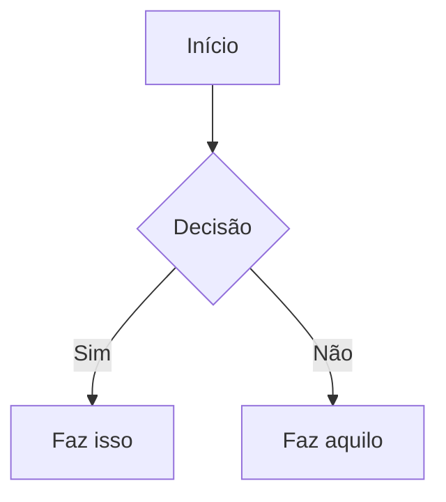

# Skill: obsidian-markdown — Explicação em Português (BR)

> Explica o conteúdo de [`SKILL.md`](SKILL.md). Não edite o `SKILL.md` (texto em inglês
> é o que faz a skill disparar). Aqui está a tradução comentada.

## O que esta skill faz

Ensina o agente a **criar e editar notas `.md`** usando o "Markdown com sabor Obsidian"
(*Obsidian Flavored Markdown*) — ou seja, o Markdown comum **mais** as extensões próprias
do Obsidian: wikilinks, embeds, callouts, propriedades, comentários etc.

O Markdown padrão (títulos, negrito, itálico, listas, tabelas, blocos de código) é dado
como já conhecido. A skill cobre só o que é **específico do Obsidian**.

## Fluxo para criar uma nota

1. **Frontmatter** com propriedades (título, tags, aliases) no topo do arquivo.
2. **Escrever o conteúdo** com Markdown comum + a sintaxe Obsidian abaixo.
3. **Linkar notas** com wikilinks (`[[Nota]]`) para links internos, e links Markdown
   comuns (`[texto](url)`) só para URLs externas.
4. **Incorporar (embed)** conteúdo de outras notas, imagens ou PDFs com `![[...]]`.
5. **Adicionar callouts** (caixas de destaque) com `> [!tipo]`.
6. **Conferir** se a nota renderiza certo no modo de leitura do Obsidian.

> Regra de ouro: use `[[wikilinks]]` para notas dentro do vault (o Obsidian acompanha
> renomeações automaticamente) e `[texto](url)` **só** para URLs externas.

## Links internos (Wikilinks)

```markdown
[[Nome da Nota]]                       Link para a nota
[[Nome da Nota|Texto exibido]]         Texto de exibição personalizado
[[Nome da Nota#Título]]                Link para um título dentro da nota
[[Nome da Nota#^id-do-bloco]]          Link para um bloco específico
[[#Título na mesma nota]]              Link para título na própria nota
```

Para criar um **ID de bloco**, acrescente `^id-do-bloco` ao final de um parágrafo.
Em listas e citações, coloque o ID numa linha separada logo depois do bloco.

## Embeds (incorporar conteúdo)

Coloque `!` antes de um wikilink para incorporar o conteúdo na própria nota:

```markdown
![[Nome da Nota]]                      Incorpora a nota inteira
![[Nome da Nota#Título]]               Incorpora só uma seção
![[imagem.png]]                        Incorpora imagem
![[imagem.png|300]]                    Imagem com largura de 300px
![[documento.pdf#page=3]]              Incorpora a página 3 do PDF
```

Mais tipos (áudio, vídeo, resultados de busca, imagens externas) em
[`references/EMBEDS.md`](references/EMBEDS.md).

## Callouts (caixas de destaque)

```markdown
> [!note]
> Callout básico.

> [!warning] Título personalizado
> Callout com título customizado.

> [!faq]- Recolhido por padrão
> Callout dobrável ( - recolhido, + expandido ).
```

Tipos comuns: `note`, `tip`, `warning`, `info`, `example`, `quote`, `bug`, `danger`,
`success`, `failure`, `question`, `abstract`, `todo`.
Lista completa com apelidos (aliases) e callouts customizados em CSS:
[`references/CALLOUTS.md`](references/CALLOUTS.md).

## Propriedades (Frontmatter)

```yaml
---
title: Minha Nota
date: 2024-01-15
tags:
  - projeto
  - ativo
aliases:
  - Nome Alternativo
cssclasses:
  - classe-customizada
---
```

Propriedades padrão: `tags` (rótulos pesquisáveis), `aliases` (nomes alternativos da
nota para sugestões de link), `cssclasses` (classes CSS para estilização).
Todos os tipos de propriedade em [`references/PROPERTIES.md`](references/PROPERTIES.md).

## Tags

```markdown
#tag                    Tag inline
#aninhada/tag           Tag aninhada (hierarquia)
```

Tags aceitam letras, números (não como primeiro caractere), `_`, `-` e `/` (para aninhar).
Também podem ser definidas no frontmatter, na propriedade `tags`.

## Comentários

```markdown
Texto visível %%mas isto fica oculto%% no modo leitura.

%%
Este bloco inteiro fica oculto no modo de leitura.
%%
```

## Outras formatações do Obsidian

```markdown
==Texto destacado==                    Marca-texto (destaque)
```

## Matemática (LaTeX)

```markdown
Inline: $e^{i\pi} + 1 = 0$

Bloco:
$$
\frac{a}{b} = c
$$
```

## Diagramas (Mermaid)

````markdown

````

Para ligar um nó do Mermaid a uma nota do Obsidian, adicione `class NomeDoNo internal-link;`.

## Notas de rodapé

```markdown
Texto com nota de rodapé[^1].

[^1]: Conteúdo da nota.

Nota inline.^[Isto é inline.]
```

## Referências

- [Obsidian Flavored Markdown](https://help.obsidian.md/obsidian-flavored-markdown)
- [Links internos](https://help.obsidian.md/links)
- [Embeds](https://help.obsidian.md/embeds)
- [Callouts](https://help.obsidian.md/callouts)
- [Propriedades](https://help.obsidian.md/properties)
